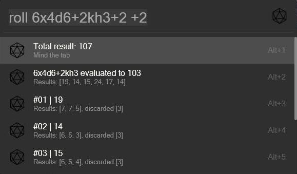
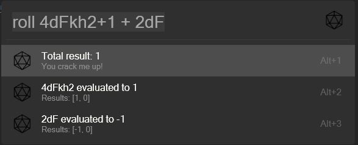

# RollDice (Flow.Launcher.Plugin.RollDice)

A quick way to roll some dice.

## About

Rolls the given dice, sums the results and evaluates the equation.
The details of each roll are listed below the result.

As part of the `2.0` rework I added some fun messages based on the linux fortune package because I felt like it.

## Requirements

To use Python Plugins within Flow you'll need Python v3.10 or later installed on your system.
You also may need to select your Python installation directory in the Flow Launcher Settings.
As of v1.8, Flow Launcher should take care of the installation of Python for you if it is not on your system.

## Installing

The Plugin has been officially added to the supported list of plugins.
Use `pm install RollDice` to install.

However you can also manually add it.

### Manual

Add the plugins folder to %APPDATA%\Roaming\FlowLauncher\Plugins\ and run the Flow command `restart Flow Launcher`.

#### Python Package Requirements

This plugin depends on the python `flowlauncher` and `dice-rolling` packages.

> Without these packages installed in your python environment the plugin won't work!

The easiest way to install them, is to open a CLI like Powershell, navigate into the plugins folder and run the following command:

`pip install -r requirements.txt`

## Usage

As of version `2.0` you can do stuff like this: `roll 6x4d6kh3 * 5`.
I highly recommend to check this awesome package out: [dice-rolling](https://github.com/Ajordat/dice_rolling).

| row | Command                               | Example            | Description                                                                                                                                                  |
| --- | ------------------------------------- | ------------------ | ------------------------------------------------------------------------------------------------------------------------------------------------------------ |
| 1   | `roll {dice}`                         | `roll 1d20`        | Rolls an amount of dice with the given sides and sums up the result                                                                                          |
| 2   | `roll {fate dice}`                    | `roll 4dF`         | Rolls four times within the range [-1, 0, 1]. *This works as any other die and may be combined with any of the rows below.*                                  |
| 3   | `roll {repititions}x{dice}`           | `roll 6x1d20`      | Repeats the dice roll six times and lists each result separately. See first screenshot.                                                                      |
| 4   | `roll {dice}{addition}`               | `roll 4d6+3`       | Adds +3 to each rolled d6. *Please note, that adding a space character before the `+` results in the behaviour described in row 8.*                          |
| 5   | `roll {dice}{keep}`                   | `roll 4d6kh3`      | Discards the lowest roll by keeping the highest three.                                                                                                       |
| 6   | `roll {dice}{keep}{addition}`         | `roll 4d6kh3+2`    | Same as row 5 and adds two to the total result.                                                                                                              |
| 7   | `roll {dice}{addition}{keep}`         | `roll 4d6+2kl2`    | Same as row 4 and then keeps the lowest two rolls.                                                                                                           |
| 8   | `roll {any roll} {basic arithmetics}` | `roll 4dF+3kh3 /3` | Does all of the above and then applies given arithmetics. Math! *Note: supported operations are limited to (`mult, div, plus, minus`) due to system safety.* |

## Problems, errors and feature requests

Open an issue in this repo and add as much info as possible.
