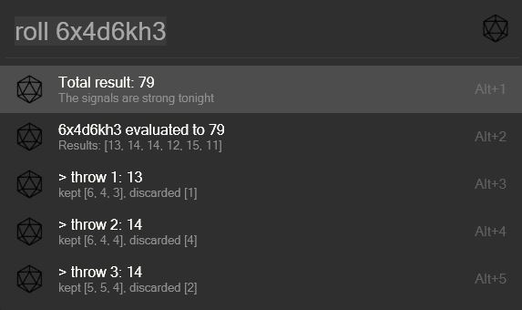

# RollDice (Flow.Launcher.Plugin.RollDice)

A quick way to roll some dices.

## About

Rolls the given dices, sums the results and evaluates the equation.
The details of each roll are listed below the result.

## Requirements

To use Python Plugins within Flow you'll need Python 3.5 or later installed on your system.
You also may need to select your Python installation directory in the Flow Launcher Settings.
As of v1.8, Flow Launcher should take care of the installation of Python for you if it is not on your system.

### Installing

The Plugin has been officially added to the supported list of plugins. 
Use `pm install RollDice` to install.

However you can also manually add it.

### Manual

Add the plugins folder to %APPDATA%\Roaming\FlowLauncher\Plugins\ and run the Flow command `restart Flow Launcher`.

### Python Package Requirements

This plugin depends on the python `flowlauncher` and `dice-rolling` packages.

> Without these packages installed in your python environment the plugin won't work!

The easiest way to install them, is to open a CLI like Powershell, navigate into the plugins folder and run the following command:

`pip install -r requirements.txt`

## Usage

Dices are defined in the pattern `{amount}d{sides}`.

| Command |Example | Description | 
| --- | --- | --- |
| `roll {dices}` | `roll 1d20` |Rolls an amount of dices with the given sides and sums up the result |
| `roll {dices} ({operator} [{number} \| {dices}])*` | `roll 3d8 + 6 * 1d20 - 1d6` | Rolls the dices and calculates the given operation |

You can concatenate as many rolls as you want via the following operators: `+`, `-`, `*`, `/`.

> Don't forget the spaces between the operators and the dices or numbers!

The dice rolls will be replaced by the resulting sum of the flow before the total evaluation of the evaluation.
Thus `6 * 1d20` will become six times the result of the d20 roll. 
To roll a d20 six times simply write `6d20` instead.

## Problems, errors and feature requests

Open an issue in this repo.
